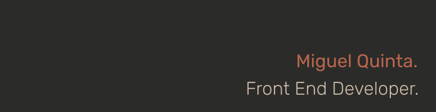

[mvqdev.com](https://www.mvqdev.com/)

### Hi
✨ I'm Miguel Quinta, a front-end developer and a curious one about mobile.
Former 3D Artist, I embraced a career change looking to fulfill both my personal and professional needs. Been running alongside different technologies all my life. Now, as a developer, I live among them.

I'm currently working as a Frontend Developer developing with different tech stacks. Growing everyday, I'm giving steady steps in merging all my new knowledge and experience into being a more solid developer.

Being self-taught I am constantly practicing and, over the past few months, I've built along the way, [1+Pomodoro](https://onemorepomodoro.netlify.app/) (Web App) and [1+Password](https://play.google.com/store/apps/details?id=com.mvqdev.onemorepassword) (Android App).

##

🔭 Developing a personal crossplatform app. 

🌱 Currently learning, Typescript for React & Ionic

##

📫 Reach me at: 
mvqdev@gmail.com 
[Personal Website](https://www.mvqdev.com/)

##

