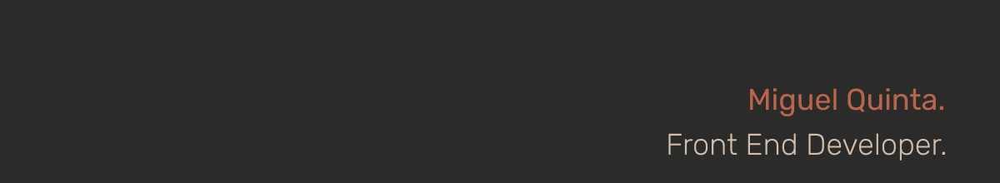

### Hi
✨ I'm Miguel Quinta, a front-end developer and a curious one about mobile.
Former 3D Artist, I embraced a career change looking to fullfill both my personal and professional needs. Been running long side different technologies all my life. Now, as developer, I live among them.

Being self-taught, I've been constantly learning over the past few months building, along the way, [1+Pomodoro](https://onemorepomodoro.netlify.app/) (Web App) and [1+Password](https://play.google.com/store/apps/details?id=com.mvqdev.onemorepassword) (Android App).

I'm looking for an entry position to learn and gain professional experience. I want to give the next step merging all the experience I gathered over several 3D productions and my eager to grow.

##

🔭 I'm currently working on my personal website but already with my eyes on my next personal project.

🌱 Currently learning, well, everything! 
Lately I've been working with React and everyday I learn and train more and more all my JavaScript, HTML and CSS knowledge and foundations.

##

📫 Reach me at:
mvqdev@gmail.com

##

